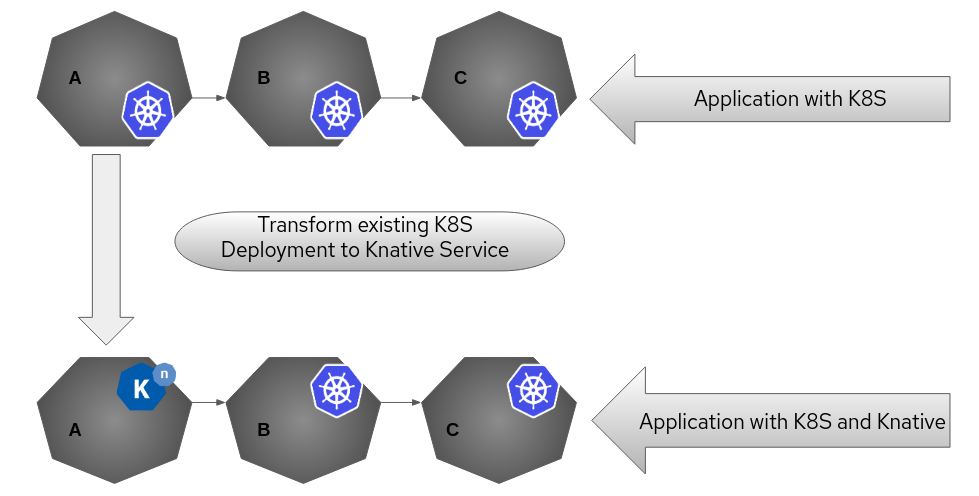

# RedHat Summit 2020 Demo Example

How easily we can use Knative service with the existing knowledge of Kubernetes Deployment



Below are the steps to follow in order to setup Knative and executing demo example

# Prerequisites
* Kubernetes cluster v1.15 or newer, as well as a compatible kubectl. This guide assumes that you have already created a Kubernetes cluster.

# Concepts
* To learn about Knative [Follow](https://knative.dev/docs/)
* To learn internals of Serving [Follow](https://knative.dev/docs/serving/)
* To get hands dirty try it out these [examples](https://knative.dev/docs/serving/samples/)

### Note: Used minikube to execute all the instruction

# Setup
* [Follow](https://knative.dev/docs/install/any-kubernetes-cluster/#installing-the-serving-component) to install Knative and Networking solution.

# Instructions
* git clone https://github.com/savitaashture/summit2020/
* cd summit2020

## Create Kubernetes yamls
```bash
$ kubectl apply -f yamls/k8s/
```
```bash
$ kubectl get svc
```
* `curl http://<minikubeIP>:<svcNodePort>/abc`
